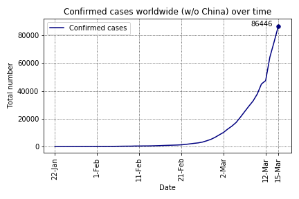
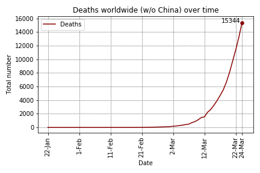
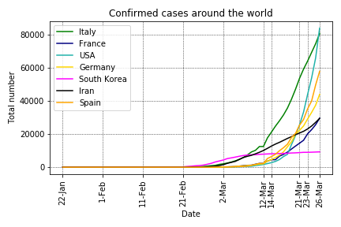
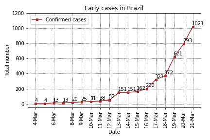
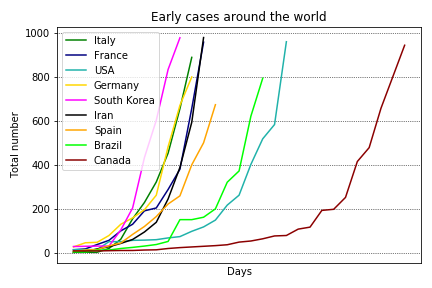

# Covid-19 (Coronovirus) analysis

## Overview
On March 11, 2020, the World Health Organization (WHO) declared the Covid-19 (a.k.a. new coronavirus) a pandemic. Since January 22, 2020, the Johns Hopkins CSSE maintains a [data repository](https://github.com/CSSEGISandData/COVID-19) to track the Covid-19 incidence worldwide. In order to understand a little bit how this disease will affect my country (Brazil), I performed some data analysis in this data.

For Portuguese speakers, I wrote a post in my blog about this analysis: [O que os dados dizem sobre o Coronavírus?](http://computacaointeligente.com.br/coolstuffs/analisando-coronavirus/)

## Some plots and tables got during the analysis (updated on March 23, 2020)
### Covid-19 worldwide (without China):

### Deaths worldwide (without China):

### Top 10 infected countries
| Country/Region   |   Confirmed |   Deaths |   Recovered |   % Deaths  |    % Population |
|:-----------------|------------:|---------:|------------:|------------:|-----------:|
| China            |       81397 |     3265 |       72362 |     4.0112  | 0.00584442 |
| Italy            |       59138 |     5476 |        7024 |     9.2597  | 0.0978599  |
| US               |       33272 |      417 |           0 |     1.25331 | 0.0101697  |
| Spain            |       28768 |     1772 |        2575 |     6.15962 | 0.0615704  |
| Germany          |       24873 |       94 |         266 |     0.37792 | 0.0299935  |
| Iran             |       21638 |     1685 |        7931 |     7.78723 | 0.0264522  |
| France           |       16176 |      674 |        2206 |     4.16667 | 0.0241479  |
| Korea, South     |        8897 |      104 |        2909 |     1.16893 | 0.0172305  |
| Switzerland      |        7245 |       98 |         131 |     1.35266 | 0.0850697  |
| United Kingdom   |        5741 |      282 |          67 |     4.91204 | 0.00863451 |

### Comparing confirmed cases around the world

### Early cases in Brazil

### Comparing early cases around the world

## Running the code
The analysis was coded in Python using Jupyter Notebook. To install the requirement:

`pip install requirements.txt `

First, run the `get_data.ipynb` script to get the most updated data from the [Johns Hopkins repository](https://github.com/CSSEGISandData/COVID-19).

Next, run the `analysis.ipynb` code and have fun

## Other analysis
Some people are also working on this data and providing some insightful analysis on Kaggle. You may want to check them as well:
- [COVID-19 - Analysis, Viz, Prediction & Comparisons](https://www.kaggle.com/imdevskp/covid-19-analysis-viz-prediction-comparisons)
- [Coronavirus (COVID-19) Visualization & Prediction](https://www.kaggle.com/therealcyberlord/coronavirus-covid-19-visualization-prediction)
- [Novel Corona Virus 2019 Dataset](https://www.kaggle.com/sudalairajkumar/novel-corona-virus-2019-dataset)

**If you find some bug or have any further question please let me know**

