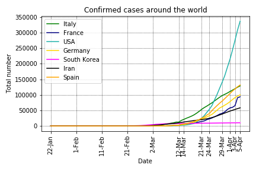

# Covid-19 (Coronovirus) analysis

## Overview
On March 11, 2020, the World Health Organization (WHO) declared the Covid-19 (a.k.a. new coronavirus) a pandemic. Since January 22, 2020, the Johns Hopkins CSSE maintains a [data repository](https://github.com/CSSEGISandData/COVID-19) to track the Covid-19 incidence worldwide. In order to understand a little bit how this disease will affect my country (Brazil), I performed some data analysis in this data.

For Portuguese speakers, I wrote a post in my blog about this analysis: [O que os dados dizem sobre o Coronavírus?](http://computacaointeligente.com.br/coolstuffs/analisando-coronavirus/)

## Some plots and tables got during the analysis (updated on March 15, 2020)
### Covid-19 worldwide (without China):

### Deaths worldwide (without China):

### Top 10 infected countries
| Country/Region   |   Confirmed |   Deaths |   Recovered |   % Deaths  |    % Population |
|:-----------------|------------:|---------:|------------:|------------:|-----------:|
| China            |       81003 |     3203 |       67017 |    3.95417  | 0.00581613 |
| Italy            |       24747 |     1809 |        2335 |    7.30998  | 0.0409506  |
| Iran             |       13938 |      724 |        4590 |    5.19443  | 0.0170391  |
| Korea, South     |        8162 |       75 |         510 |    0.918892 | 0.015807   |
| Spain            |        7798 |      289 |         517 |    3.70608  | 0.0166896  |
| Germany          |        5795 |       11 |          46 |    0.189819 | 0.006988   |
| France           |        4513 |       91 |          12 |    2.0164   | 0.0067371  |
| US               |        3499 |       63 |          12 |    1.80051  | 0.00106948 |
| Switzerland      |        2200 |       14 |           4 |    0.636364 | 0.0258321  |
| Norway           |        1221 |        3 |           1 |    0.2457   | 0.0229756  |

### Comparing confirmed cases around the world

### Early cases in Brazil

### Comparing early cases around the world

## Running the code
The analysis was coded in Python using Jupyter Notebook. To install the requirement:

`pip install requirements.txt `

First, run the `get_data.ipynb` script to get the most updated data from the [Johns Hopkins repository](https://github.com/CSSEGISandData/COVID-19).

Next, run the `analysis.ipynb` code and have fun

## Other analysis
Some people are also working on this data and providing some insightful analysis on Kaggle. You may want to check them as well:
- [COVID-19 - Analysis, Viz, Prediction & Comparisons](https://www.kaggle.com/imdevskp/covid-19-analysis-viz-prediction-comparisons)
- [Coronavirus (COVID-19) Visualization & Prediction](https://www.kaggle.com/therealcyberlord/coronavirus-covid-19-visualization-prediction)
- [Novel Corona Virus 2019 Dataset](https://www.kaggle.com/sudalairajkumar/novel-corona-virus-2019-dataset)

**If you find some bug or have any further question please let me know**

