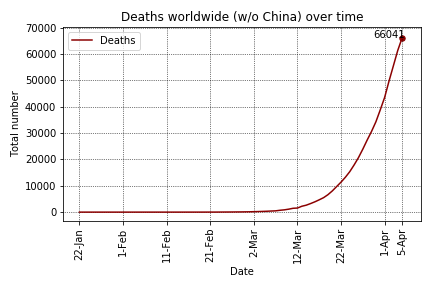

# Covid-19 (Coronovirus) analysis

## Overview
On March 11, 2020, the World Health Organization (WHO) declared the Covid-19 (a.k.a. new coronavirus) a pandemic. Since January 22, 2020, the Johns Hopkins CSSE maintains a [data repository](https://github.com/CSSEGISandData/COVID-19) to track the Covid-19 incidence worldwide. In order to understand a little bit how this disease will affect my country (Brazil), I performed some data analysis in this data.

For Portuguese speakers, I wrote a post in my blog about this analysis: [O que os dados dizem sobre o Coronavírus?](http://computacaointeligente.com.br/coolstuffs/analisando-coronavirus/)

## Some plots and tables got during the analysis (updated on March 21, 2020)
### Covid-19 worldwide (without China):

### Deaths worldwide (without China):

### Top 10 infected countries
| Country/Region   |   Confirmed |   Deaths |   Recovered |   % Deaths  |    % Population |
|:-----------------|------------:|---------:|------------:|------------:|-----------:|
| China            |       81250 |     3253 |       71266 |    4.00369  | 0.00583387 |
| Italy            |       47021 |     4032 |        4440 |    8.57489  | 0.077809   |
| Spain            |       20410 |     1043 |        1588 |    5.11024  | 0.0436823  |
| Germany          |       19848 |       67 |         180 |    0.337565 | 0.023934   |
| Iran             |       19644 |     1433 |        6745 |    7.29485  | 0.0240146  |
| US               |       19100 |      244 |           0 |    1.27749  | 0.00583799 |
| France           |       12726 |      450 |          12 |    3.53607  | 0.0189976  |
| Korea, South     |        8652 |       94 |        1540 |    1.08645  | 0.016756   |
| Switzerland      |        5294 |       54 |          15 |    1.02002  | 0.0621614  |
| United Kingdom   |        4014 |      178 |          67 |    4.43448  | 0.00603709 |

### Comparing confirmed cases around the world

### Early cases in Brazil

### Comparing early cases around the world

## Running the code
The analysis was coded in Python using Jupyter Notebook. To install the requirement:

`pip install requirements.txt `

First, run the `get_data.ipynb` script to get the most updated data from the [Johns Hopkins repository](https://github.com/CSSEGISandData/COVID-19).

Next, run the `analysis.ipynb` code and have fun

## Other analysis
Some people are also working on this data and providing some insightful analysis on Kaggle. You may want to check them as well:
- [COVID-19 - Analysis, Viz, Prediction & Comparisons](https://www.kaggle.com/imdevskp/covid-19-analysis-viz-prediction-comparisons)
- [Coronavirus (COVID-19) Visualization & Prediction](https://www.kaggle.com/therealcyberlord/coronavirus-covid-19-visualization-prediction)
- [Novel Corona Virus 2019 Dataset](https://www.kaggle.com/sudalairajkumar/novel-corona-virus-2019-dataset)

**If you find some bug or have any further question please let me know**

