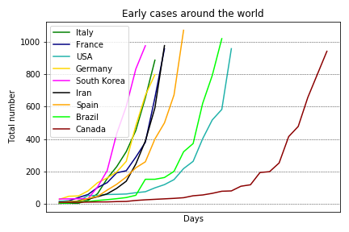

# Covid-19 (Coronovirus) analysis

## Overview
On March 11, 2020, the World Health Organization (WHO) declared the Covid-19 (a.k.a. new coronavirus) a pandemic. Since January 22, 2020, the Johns Hopkins CSSE maintains a [data repository](https://github.com/CSSEGISandData/COVID-19) to track the Covid-19 incidence worldwide. In order to understand a little bit how this disease will affect my country (Brazil), I performed some data analysis in this data.

For Portuguese speakers, I wrote a post in my blog about this analysis: [O que os dados dizem sobre o Coronavírus?](http://computacaointeligente.com.br/coolstuffs/analisando-coronavirus/)

## Some plots and tables got during the analysis (updated on March 27, 2020)
### Covid-19 worldwide (without China):

### Deaths worldwide (without China):

### Top 10 infected countries
| Country/Region   |   Confirmed |   Deaths |   % Deaths  |% Population|
|:-----------------|------------:|---------:|------------:|-----------:|
| US               |       83836 |     1209 |    1.4421   | 0.0256248  |
| China            |       81782 |     3291 |    4.02411  | 0.00587206 |
| Italy            |       80589 |     8215 |   10.1937   | 0.133356   |
| Spain            |       57786 |     4365 |    7.55373  | 0.123676   |
| Germany          |       43938 |      267 |    0.607674 | 0.0529834  |
| France           |       29551 |     1698 |    5.746    | 0.0441144  |
| Iran             |       29406 |     2234 |    7.59709  | 0.0359485  |
| United Kingdom   |       11812 |      580 |    4.91026  | 0.0177653  |
| Switzerland      |       11811 |      191 |    1.61714  | 0.138683   |
| Korea, South     |        9241 |      131 |    1.4176   | 0.0178967  |

### Comparing confirmed cases around the world

### Early cases in Brazil

### Comparing early cases around the world

## Running the code
The analysis was coded in Python using Jupyter Notebook. To install the requirement:

`pip install requirements.txt `

First, run the `get_data.ipynb` script to get the most updated data from the [Johns Hopkins repository](https://github.com/CSSEGISandData/COVID-19).

Next, run the `analysis.ipynb` code and have fun

## Other analysis
Some people are also working on this data and providing some insightful analysis on Kaggle. You may want to check them as well:
- [COVID-19 - Analysis, Viz, Prediction & Comparisons](https://www.kaggle.com/imdevskp/covid-19-analysis-viz-prediction-comparisons)
- [Coronavirus (COVID-19) Visualization & Prediction](https://www.kaggle.com/therealcyberlord/coronavirus-covid-19-visualization-prediction)
- [Novel Corona Virus 2019 Dataset](https://www.kaggle.com/sudalairajkumar/novel-corona-virus-2019-dataset)

**If you find some bug or have any further question please let me know**

